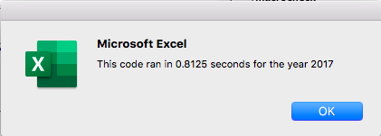
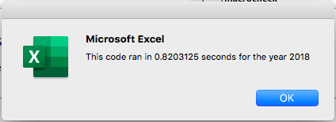
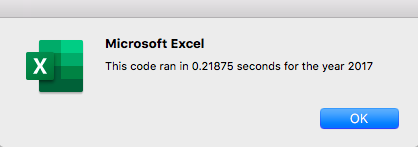
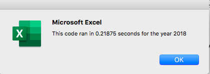
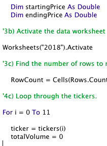
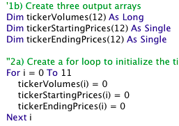

# Refactoring with VBA

## Overview of the project

### Purpose
The purpose of this challenge was to refactor the original module and create one that is more efficient. The original module allowed Steve to see the data set of 2017 and 2018 by using the button macro. The new module will edit the VBA code to perform faster.

## Results
Based on the given data, there is almost a night and day difference between the two results. The data shows that only *TERP* stock had a negative percentage value in 2017 whereas *ENPH* and *RUN* are the only stocks with a positive percentage value in 2018.
By editing the original code, I was able to get the code to run in an estimated 0.2 seconds which is about 0.6 seconds faster than my original code processed. There were also some instances where I would get faster results.
### Old Runtimes

### New Runtimes

## Advantages and Disadvantages of Refactoring Code
### Advantages
The most notable advantage for refactoring would be that it makes the run time seemingly faster. The particular job is much more efficient especially when there is a lot of data to consider. Another notable advantage would be that the code is formatted to look much cleaner with everything all together. 
Previously, I had three modules doing the same thing this new singular module does. These changes will make it more straightforward if someone else would want to add anything to the existing code. 

### Disadvantages
The only downside in refactoring a code would be the human error involved in rewriting the code. I noticed that when I reapplied the same formula again, I received numerous errors that would not allow me to run my new code. The only solution I was able to find was to add (12) in the arrays section and (i) for my loops. This was somehow not needed in my original code in order to achieve the same results.

                                
